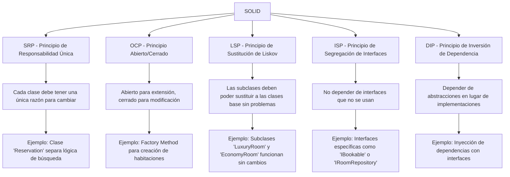

### Principios SOLID en el Contexto de la Refactorización del Sistema de Reservas de Hotel

Los principios **SOLID** son un conjunto de cinco directrices para escribir código limpio, estructurado y fácil de mantener. Ayudan a evitar el "código espagueti", reduciendo la duplicación, el acoplamiento entre clases y facilitando la distribución adecuada de responsabilidades. A continuación, se explica cada principio y cómo aplicarlo en la refactorización del **Sistema de Reservas de Hotel**.

---

---

## **S - Single Responsibility Principle (SRP) - Principio de Responsabilidad Única**
**Cada clase o módulo debe tener una única razón para cambiar.**

- **Problema en el sistema:** La clase `Reservation` gestiona tanto la lógica de reserva como la búsqueda de habitaciones.
- **Solución:** 
  - Divide la lógica de búsqueda en una nueva clase o estrategia específica.
  - Aplica patrones como **Strategy** para separar las diferentes estrategias de reserva.
  - Cada clase debe enfocarse en una tarea específica, facilitando su mantenimiento y pruebas.

---

## **O - Open/Closed Principle (OCP) - Principio Abierto/Cerrado**
**Las clases deben estar abiertas para extensión, pero cerradas para modificación.**

- **Problema en el sistema:** Cada vez que quieras agregar un nuevo tipo de habitación, necesitas modificar la clase `Hotel`.
- **Solución:** 
  - Utiliza el **Factory Method** para encapsular la creación de objetos `Room`. 
  - Esto permite extender el sistema (por ejemplo, añadiendo nuevos tipos de habitaciones) sin modificar las clases existentes.

---

## **L - Liskov Substitution Principle (LSP) - Principio de Sustitución de Liskov**
**Las subclases deben poder sustituir a sus clases base sin alterar el comportamiento del sistema.**

- **Problema:** Si en el futuro necesitas crear subclases de `Room` (como `LuxuryRoom` o `EconomyRoom`), el sistema debe funcionar sin problemas.
- **Solución:** 
  - Asegúrate de que las subclases puedan sustituir a la clase base sin romper el comportamiento del programa.
  - Esto garantiza que cualquier tipo de `Room` funcione igual en el proceso de reserva sin cambios adicionales.

---

## **I - Interface Segregation Principle (ISP) - Principio de Segregación de Interfaces**
**Una clase no debería depender de interfaces que no utiliza.**

- **Problema:** Si la clase `Reservation` dependiera de métodos que no son relevantes para su tarea (por ejemplo, detalles internos de `Hotel`).
- **Solución:** 
  - Define interfaces específicas y claras, como `IBookable` o `IRoomRepository`.
  - Esto evita que las clases dependan de métodos innecesarios y mejora la flexibilidad del sistema.

---

## **D - Dependency Inversion Principle (DIP) - Principio de Inversión de Dependencia**
**Las clases deben depender de abstracciones (interfaces) en lugar de implementaciones concretas.**

- **Problema en el sistema:** La clase `Reservation` depende directamente de la implementación de `Hotel` y `Room`, lo que aumenta el acoplamiento.
- **Solución:** 
  - Utiliza **inyección de dependencias** para pasar interfaces como `IRoomRepository` en lugar de instancias concretas de `Hotel`.
  - Esto reduce el acoplamiento y hace que el código sea más fácil de mantener y probar.

---

### **Cómo Aplicar SOLID en la Refactorización del Sistema de Reservas de Hotel**

- **Elimina código duplicado:** Encapsula la creación de habitaciones usando el **Factory Method**.
- **Distribuye responsabilidades:** Utiliza el **Strategy Pattern** para manejar diferentes tipos de reservas.
- **Reduce acoplamiento:** Implementa el **Singleton Pattern** para gestionar la instancia global del hotel.
- **Facilita la escalabilidad:** Aplica el **Observer Pattern** para notificar cambios a servicios externos (como limpieza).

Con estos principios, el sistema refactorizado será más **estructurado, legible y fácil de mantener**, eliminando duplicación y distribuyendo las responsabilidades de manera coherente.
