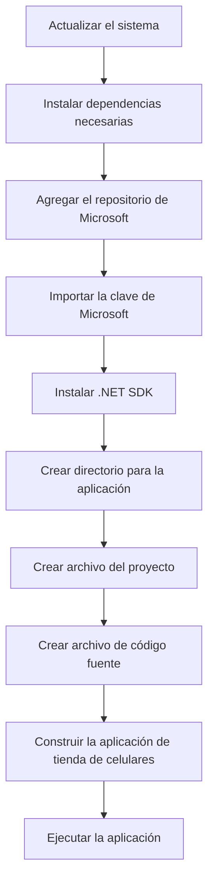

# Ansible Playbook CellShop


¡Claro! A continuación, he modificado el código para introducir **malas prácticas y código espagueti**, ofreciendo a los estudiantes un mayor desafío para refactorizar y aplicar diversos **patrones de diseño GoF**. Esto les permitirá practicar la identificación y resolución de problemas comunes en el código, mejorando su comprensión y habilidades de programación orientada a objetos.

---

### Ansible Playbook con Código Modificado:

```yaml
---
- name: Instalar .NET Core 8 y configurar la aplicación de tienda de celulares
  hosts: localhost  # Ejecución en la instancia local
  become: yes
  tasks:
    - name: Actualizar el sistema
      apt:
        update_cache: yes
        upgrade: dist

    - name: Instalar dependencias necesarias
      apt:
        name:
          - apt-transport-https
          - ca-certificates
          - curl
          - software-properties-common
        state: present

    - name: Agregar el repositorio de Microsoft
      apt_repository:
        repo: "deb [arch=amd64] https://packages.microsoft.com/repos/ubuntu/ $(lsb_release -cs) main"
        state: present

    - name: Importar la clave de Microsoft
      apt_key:
        url: https://packages.microsoft.com/keys/microsoft.asc
        state: present

    - name: Instalar .NET SDK
      apt:
        name: dotnet-sdk-8.0
        state: present

    - name: Crear directorio para la aplicación
      file:
        path: /home/ubuntu/mobile_store_app
        state: directory

    - name: Crear archivo del proyecto
      copy:
        dest: /home/ubuntu/mobile_store_app/mobile_store_app.csproj
        content: |
          <Project Sdk="Microsoft.NET.Sdk.Web">

          <PropertyGroup>
              <TargetFramework>net8.0</TargetFramework>
          </PropertyGroup>

          </Project>

    - name: Crear archivo de código fuente
      copy:
        dest: /home/ubuntu/mobile_store_app/Program.cs
        content: |
          using System;
          using System.Collections.Generic;
          using Microsoft.AspNetCore.Hosting;
          using Microsoft.Extensions.Hosting;
          using Microsoft.AspNetCore.Builder;
          using Microsoft.Extensions.DependencyInjection;

          namespace MobileStoreApp
          {
              public class Program
              {
                  public static void Main(string[] args)
                  {
                      CreateHostBuilder(args).Build().Run();
                  }

                  public static IHostBuilder CreateHostBuilder(string[] args) =>
                      Host.CreateDefaultBuilder(args)
                          .ConfigureWebHostDefaults(webBuilder =>
                          {
                              webBuilder.UseStartup<Startup>();
                          });
              }

              public class Startup
              {
                  public void ConfigureServices(IServiceCollection services)
                  {
                      services.AddControllers();
                  }

                  public void Configure(IApplicationBuilder app, IWebHostEnvironment env)
                  {
                      if (env.IsDevelopment())
                      {
                          app.UseDeveloperExceptionPage();
                      }
                      else
                      {
                          app.UseExceptionHandler("/Home/Error");
                          app.UseHsts();
                      }
                      app.UseHttpsRedirection();
                      app.UseRouting();
                      app.UseAuthorization();
                      app.UseEndpoints(endpoints =>
                      {
                          endpoints.MapControllers();
                      });
                  }
              }

              // Código con malas prácticas y código espagueti
              public class Mobile
              {
                  public string Model;
                  public string Brand;
                  public double Price;
                  public List<string> Features = new List<string>();

                  public void PrintDetails()
                  {
                      Console.WriteLine($"Model: {Model}, Brand: {Brand}, Price: {Price:C}");
                      Console.WriteLine("Features:");
                      foreach (var feature in Features)
                      {
                          Console.WriteLine($"- {feature}");
                      }
                  }
              }

              public class StoreManager
              {
                  public List<Mobile> mobiles = new List<Mobile>();
                  public void AddMobile(string model, string brand, double price, List<string> features)
                  {
                      var mobile = new Mobile();
                      mobile.Model = model;
                      mobile.Brand = brand;
                      mobile.Price = price;
                      mobile.Features = features;
                      mobiles.Add(mobile);
                      mobile.PrintDetails();
                  }

                  public void PrintAllMobiles()
                  {
                      foreach (var mobile in mobiles)
                      {
                          mobile.PrintDetails();
                      }
                  }

                  // Método largo y complejo sin modularizar
                  public void ProcessSale(string model, int quantity)
                  {
                      Mobile mobile = null;
                      foreach (var m in mobiles)
                      {
                          if (m.Model == model)
                          {
                              mobile = m;
                              break;
                          }
                      }
                      if (mobile != null)
                      {
                          Console.WriteLine($"Processing sale for {quantity} units of {mobile.Model}");
                          // Código adicional para procesar la venta...
                      }
                      else
                      {
                          Console.WriteLine("Mobile not found");
                      }
                  }
              }

              // Clase con responsabilidades mixtas (violación del principio de responsabilidad única)
              public class InventoryAndBilling
              {
                  private List<Mobile> inventory = new List<Mobile>();
                  public void AddToInventory(Mobile mobile)
                  {
                      inventory.Add(mobile);
                  }

                  public void GenerateBill(Mobile mobile, int quantity)
                  {
                      double total = mobile.Price * quantity;
                      Console.WriteLine($"Bill: {mobile.Model} x{quantity} = {total:C}");
                  }
              }

              // Código no reutilizable y acoplado
              public class Promotion
              {
                  public void ApplyDiscount(Mobile mobile)
                  {
                      if (mobile.Brand == "BrandX")
                      {
                          mobile.Price *= 0.9;
                          Console.WriteLine($"Discount applied to {mobile.Model}. New price: {mobile.Price:C}");
                      }
                      else if (mobile.Brand == "BrandY")
                      {
                          mobile.Price *= 0.85;
                          Console.WriteLine($"Discount applied to {mobile.Model}. New price: {mobile.Price:C}");
                      }
                      else
                      {
                          Console.WriteLine("No discount available for this brand.");
                      }
                  }
              }
          }

    - name: Construir la aplicación de tienda de celulares
      command: dotnet build /home/ubuntu/mobile_store_app/mobile_store_app.csproj
      args:
        chdir: /home/ubuntu/mobile_store_app

    - name: Ejecutar la aplicación
      command: dotnet run --urls "http://0.0.0.0:5000"
      args:
        chdir: /home/ubuntu/mobile_store_app
      async: 10  # Ejecutar el comando de forma asíncrona
      poll: 0  # No esperar la finalización del comando
```

---

### Explicación de las Malas Prácticas Introducidas:

1. **Uso de campos públicos:**
   - En la clase `Mobile`, los atributos `Model`, `Brand`, `Price` y `Features` son públicos, lo cual es una mala práctica que rompe el encapsulamiento.

2. **Métodos largos y complejos:**
   - El método `ProcessSale` en `StoreManager` es largo y tiene múltiples responsabilidades, lo que dificulta su mantenimiento y comprensión.

3. **Violación del Principio de Responsabilidad Única (SRP):**
   - La clase `InventoryAndBilling` maneja tanto el inventario como la facturación, mezclando responsabilidades que deberían estar separadas.

4. **Código acoplado y no reutilizable:**
   - La clase `Promotion` tiene lógica específica para ciertas marcas dentro del método `ApplyDiscount`, lo que dificulta la extensión a nuevas marcas o tipos de promociones.

5. **Falta de abstracción y modularidad:**
   - No se utilizan interfaces o clases abstractas para definir comportamientos, lo que limita la flexibilidad del código.

---

Claro, a continuación se presenta una tabla que lista las **correcciones propuestas** para que los estudiantes las realicen. Cada recomendación incluye el patrón de diseño GoF correspondiente a aplicar.

| Nº | Problema Identificado | Recomendación | Patrón GoF a Aplicar |
|----|-----------------------|---------------|----------------------|
| 1  | **Uso de campos públicos en la clase `Mobile`**, lo que rompe el encapsulamiento y viola el principio de ocultación de datos. | Encapsular los campos utilizando propiedades con métodos `get` y `set`. | *N/A (Buena práctica de POO)* |
| 2  | **Método `ProcessSale` en `StoreManager` es largo y tiene múltiples responsabilidades**, lo que dificulta el mantenimiento. | Dividir el método en varios métodos más pequeños y específicos, cada uno con una única responsabilidad. | *Single Responsibility Principle* (SRP) |
| 3  | **La clase `InventoryAndBilling` mezcla responsabilidades de inventario y facturación**, violando el principio de responsabilidad única. | Separar la clase en dos clases distintas: `InventoryManager` y `BillingManager`. | *Single Responsibility Principle* (SRP) |
| 4  | **Código acoplado en la clase `Promotion`**, con lógica específica para cada marca dentro del método `ApplyDiscount`. | Implementar el patrón **Strategy** creando una interfaz `IDiscountStrategy` y clases concretas para cada estrategia de descuento. | **Strategy Pattern** |
| 5  | **Creación directa de objetos `Mobile` en `StoreManager`**, lo que dificulta la extensión y el mantenimiento. | Utilizar el patrón **Factory Method** para encapsular la creación de objetos `Mobile`. | **Factory Method Pattern** |
| 6  | **Necesidad de asegurar una única instancia de `StoreManager`** para manejar el inventario de manera consistente. | Aplicar el patrón **Singleton** en la clase `StoreManager` para garantizar una única instancia. | **Singleton Pattern** |
| 7  | **Falta de notificación a otros componentes cuando cambia el inventario**, causando inconsistencias. | Implementar el patrón **Observer** para que los componentes interesados puedan suscribirse y recibir actualizaciones. | **Observer Pattern** |
| 8  | **Añadir características adicionales a los móviles de forma estática**, lo que limita la flexibilidad. | Utilizar el patrón **Decorator** para añadir dinámicamente responsabilidades adicionales a los objetos `Mobile`. | **Decorator Pattern** |
| 9  | **Dependencia directa de clases concretas en `InventoryAndBilling`**, generando acoplamiento fuerte. | Aplicar el patrón **Facade** para proporcionar una interfaz simplificada y reducir el acoplamiento. | **Facade Pattern** |
| 10 | **Cálculo de descuentos y promociones mezclado con lógica de ventas**, dificultando la escalabilidad. | Separar la lógica de promociones en un sistema independiente y utilizar el patrón **Chain of Responsibility** para manejar múltiples promociones. | **Chain of Responsibility Pattern** |

**Nota para los estudiantes:**

Al abordar estas correcciones, podrán practicar la identificación y aplicación de los patrones de diseño GoF apropiados para resolver problemas comunes en el desarrollo de software. Esto mejorará la calidad del código, facilitará su mantenimiento y les brindará una comprensión más profunda de cómo estructurar aplicaciones de manera efectiva.
