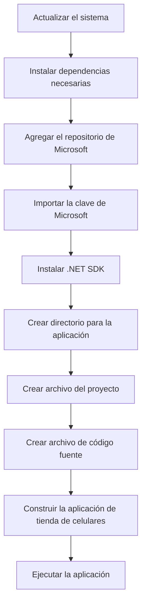

# Ansible Playbook CellShop

---

### Explicación de las Malas Prácticas Introducidasa a esta Tienda de Celulares BadCode:

1. **Uso de campos públicos:**
   - En la clase `Mobile`, los atributos `Model`, `Brand`, `Price` y `Features` son públicos, lo cual es una mala práctica que rompe el encapsulamiento.

2. **Métodos largos y complejos:**
   - El método `ProcessSale` en `StoreManager` es largo y tiene múltiples responsabilidades, lo que dificulta su mantenimiento y comprensión.

3. **Violación del Principio de Responsabilidad Única (SRP):**
   - La clase `InventoryAndBilling` maneja tanto el inventario como la facturación, mezclando responsabilidades que deberían estar separadas.

4. **Código acoplado y no reutilizable:**
   - La clase `Promotion` tiene lógica específica para ciertas marcas dentro del método `ApplyDiscount`, lo que dificulta la extensión a nuevas marcas o tipos de promociones.

5. **Falta de abstracción y modularidad:**
   - No se utilizan interfaces o clases abstractas para definir comportamientos, lo que limita la flexibilidad del código.

---

Lista las **correcciones propuestas** para reaizar donde cada recomendación incluye el patrón de diseño GoF correspondiente a aplicar.

| Nº | Problema Identificado | Recomendación | Patrón GoF a Aplicar |
|----|-----------------------|---------------|----------------------|
| 1  | **Uso de campos públicos en la clase `Mobile`**, lo que rompe el encapsulamiento y viola el principio de ocultación de datos. | Encapsular los campos utilizando propiedades con métodos `get` y `set`. | *N/A (Buena práctica de POO)* |
| 2  | **Método `ProcessSale` en `StoreManager` es largo y tiene múltiples responsabilidades**, lo que dificulta el mantenimiento. | Dividir el método en varios métodos más pequeños y específicos, cada uno con una única responsabilidad. | *Single Responsibility Principle* (SRP) |
| 3  | **La clase `InventoryAndBilling` mezcla responsabilidades de inventario y facturación**, violando el principio de responsabilidad única. | Separar la clase en dos clases distintas: `InventoryManager` y `BillingManager`. | *Single Responsibility Principle* (SRP) |
| 4  | **Código acoplado en la clase `Promotion`**, con lógica específica para cada marca dentro del método `ApplyDiscount`. | Implementar el patrón **Strategy** creando una interfaz `IDiscountStrategy` y clases concretas para cada estrategia de descuento. | **Strategy Pattern** |
| 5  | **Creación directa de objetos `Mobile` en `StoreManager`**, lo que dificulta la extensión y el mantenimiento. | Utilizar el patrón **Factory Method** para encapsular la creación de objetos `Mobile`. | **Factory Method Pattern** |
| 6  | **Necesidad de asegurar una única instancia de `StoreManager`** para manejar el inventario de manera consistente. | Aplicar el patrón **Singleton** en la clase `StoreManager` para garantizar una única instancia. | **Singleton Pattern** |
| 7  | **Falta de notificación a otros componentes cuando cambia el inventario**, causando inconsistencias. | Implementar el patrón **Observer** para que los componentes interesados puedan suscribirse y recibir actualizaciones. | **Observer Pattern** |
| 8  | **Añadir características adicionales a los móviles de forma estática**, lo que limita la flexibilidad. | Utilizar el patrón **Decorator** para añadir dinámicamente responsabilidades adicionales a los objetos `Mobile`. | **Decorator Pattern** |
| 9  | **Dependencia directa de clases concretas en `InventoryAndBilling`**, generando acoplamiento fuerte. | Aplicar el patrón **Facade** para proporcionar una interfaz simplificada y reducir el acoplamiento. | **Facade Pattern** |
| 10 | **Cálculo de descuentos y promociones mezclado con lógica de ventas**, dificultando la escalabilidad. | Separar la lógica de promociones en un sistema independiente y utilizar el patrón **Chain of Responsibility** para manejar múltiples promociones. | **Chain of Responsibility Pattern** |

Al abordar estas correcciones, podrán practicar la identificación y aplicación de los patrones de diseño GoF apropiados para resolver problemas comunes en el desarrollo de software. Esto mejorará la calidad del código, facilitará su mantenimiento y les brindará una comprensión más profunda de cómo estructurar aplicaciones de manera efectiva.
