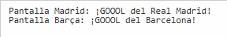

# 🏟️ Refactor de Código Espagueti → Patrón **Observer**

Este documento muestra cómo un sistema que actualiza pantallas de goles en un partido de fútbol puede mejorar su diseño pasando de un **código rígido y lleno de `if`** a un modelo **flexible con el patrón Observer**.

---

## 🚨 Código Espagueti (malo)

> En este enfoque el marcador conoce cada tipo de pantalla y decide manualmente cuándo actualizarla.  
> Cada vez que se agrega un equipo nuevo hay que modificar el método `ActualizarPantallas()` y recompilar.

```cs
using System;

public class Program
{
    public static void Main()
    {
        var marcador = new Marcador();
        marcador.ActualizarPantallas(new Gol("Real Madrid"));
        marcador.ActualizarPantallas(new Gol("Barcelona"));
    }
}

public class Gol
{
    public string Equipo { get; }
    public Gol(string equipo) => Equipo = equipo;
}

public class Marcador
{
    public void ActualizarPantallas(Gol gol)
    {
        // Observador 1 hardcodeado
        if (gol.Equipo == "Real Madrid")
            Console.WriteLine("Pantalla Madrid: ¡GOOOL del Real Madrid!");

        // Observador 2 hardcodeado
        if (gol.Equipo == "Barcelona")
            Console.WriteLine("Pantalla Barça: ¡GOOOL del Barcelona!");
    }
}
```

---

## 🧩 Patrón ausente

- **Patrón que falta:** `Observer`.
- **Motivo:** el marcador debería **notificar a todos los observadores suscritos** sin conocerlos directamente.  
  Esto elimina los `if` rígidos y hace que agregar nuevas pantallas sea tan simple como suscribirse.

---

## ✅ Código Refactorizado con Observer (bueno)

> Ahora el marcador solo **lanza eventos de gol** y las pantallas se **suscriben** con reglas simples.  
> No hace falta tocar la lógica central para agregar nuevas pantallas.

```cs
using System;
using System.Collections.Generic;

public class Program
{
    public static void Main()
    {
        var marcador = new Marcador();

        // Suscribimos pantallas con reglas
        marcador.Subscribe(g => g.Equipo == "Real Madrid", g => Console.WriteLine("Pantalla Madrid: ¡GOOOL del Real Madrid!"));
        marcador.Subscribe(g => g.Equipo == "Barcelona",  g => Console.WriteLine("Pantalla Barça: ¡GOOOL del Barcelona!"));

        marcador.Notificar(new Gol("Real Madrid"));
        marcador.Notificar(new Gol("Barcelona"));
        marcador.Notificar(new Gol("Juventus")); // nadie suscrito, no hace nada
    }
}

public record Gol(string Equipo);

public class Marcador
{
    private readonly List<(Func<Gol,bool> Filtro, Action<Gol> Handler)> _subs = new();

    public void Subscribe(Func<Gol,bool> filtro, Action<Gol> handler)
        => _subs.Add((filtro, handler));

    public void Notificar(Gol gol)
    {
        foreach (var s in _subs)
            if (s.Filtro(gol)) s.Handler(gol);
    }
}
```

---

## 🖥️ Ejecución

Al correr el refactor, se verá algo como:

Pantalla Madrid: ¡GOOOL del Real Madrid!  
Pantalla Barça: ¡GOOOL del Barcelona!



---

## ⚽ Beneficios del cambio

- ✅ **Menos acoplamiento:** el marcador no sabe qué pantallas existen.  
- ✅ **Extensible:** agregar un equipo = solo suscribirse, sin tocar la clase principal.  
- ✅ **Pruebas simples:** se pueden simular pantallas sin cambiar la lógica central.  
- ✅ **Código limpio:** sin bloques enormes de `if` que crecen con cada nueva condición.

