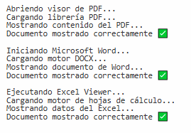

# 🧩 Refactor de Código Espagueti aplicando Template Method (C#)

## 💀 Código Espagueti (con `switch-case`)

Este código inicial presenta varios problemas de mantenimiento, duplicación y extensibilidad.  

```csharp
using System;

public class Program
{
    public static void Main()
    {
        string tipo = "PDF";
        MostrarDocumento(tipo);
        
        tipo = "WORD";
        MostrarDocumento(tipo);
        
        tipo = "EXCEL";
        MostrarDocumento(tipo);
    }

    public static void MostrarDocumento(string tipo)
    {
        if (tipo == "PDF")
        {
            Console.WriteLine("Abriendo visor de PDF...");
            Console.WriteLine("Cargando librería PDF...");
            Console.WriteLine("Mostrando contenido del PDF...");
            Console.WriteLine("------------------------------");
        }
        else if (tipo == "WORD")
        {
            Console.WriteLine("Iniciando Microsoft Word...");
            Console.WriteLine("Cargando motor DOCX...");
            Console.WriteLine("Mostrando documento de Word...");
            Console.WriteLine("------------------------------");
        }
        else if (tipo == "EXCEL")
        {
            Console.WriteLine("Ejecutando Excel Viewer...");
            Console.WriteLine("Cargando motor de hojas de cálculo...");
            Console.WriteLine("Mostrando datos del Excel...");
            Console.WriteLine("------------------------------");
        }
        else
        {
            Console.WriteLine("Tipo de documento no reconocido.");
        }
    }
}
```
# ⚠️ Problemas Detectados (Code Smells)

| **Code Smell** | **Descripción** |
|----------------|-----------------|
| **🍝 Código Espagueti** | Lógica enredada y repetitiva dentro de una sola función, lo que dificulta la lectura y el mantenimiento. |
| **🚫 Violación del Principio OCP (Open/Closed Principle)** | Cada vez que se agrega un nuevo tipo de documento, es necesario modificar la función `MostrarDocumento`, violando el principio de estar *abierto a la extensión pero cerrado a la modificación*. |
| **📄 Duplicación de Código** | Los pasos generales (abrir, cargar, mostrar) se repiten en cada caso, aumentando el riesgo de errores y el esfuerzo de mantenimiento. |
| **🧠 Difícil de Mantener y Probar** | El código mezcla la lógica de negocio con la presentación, dificultando las pruebas unitarias y la evolución del sistema. |

---

# 🔍 Patrón Ausente: Template Method

## 🧠 Identificación

El patrón **Template Method** es el que falta porque:

- Todos los tipos de documentos siguen el mismo flujo general: **abrir → cargar → mostrar**.  
- Cada documento tiene diferentes implementaciones, pero la secuencia es común.  
- Se puede definir una **plantilla del proceso en una clase base** y dejar los detalles a las subclases.

---

## 💬 Justificación

El patrón **Template Method** permite:

- 🧩 **Centralizar el flujo común** del algoritmo.  
- 🔁 **Reducir la duplicación de código.**  
- 🚀 **Cumplir con el principio Open/Closed (OCP).**  
- ✨ **Hacer el código más limpio, mantenible y extensible.**

---

# ⚙️ Implementación Parcial del Refactor (Solo una Parte Funcional)

En esta parte se muestra únicamente el funcionamiento básico para el tipo de documento **PDF**, aplicando el flujo definido por el patrón **Template Method**.

---

```csharp
using System;

public abstract class DocumentTemplate
{
    public void Mostrar()
    {
        AbrirVisor();
        CargarLibreria();
        MostrarContenido();
        Console.WriteLine("------------------------------");
    }

    protected abstract void AbrirVisor();
    protected abstract void CargarLibreria();
    protected abstract void MostrarContenido();
}

public class PDFDocument : DocumentTemplate
{
    protected override void AbrirVisor()
    {
        Console.WriteLine("Abriendo visor de PDF...");
    }

    protected override void CargarLibreria()
    {
        Console.WriteLine("Cargando librería PDF...");
    }

    protected override void MostrarContenido()
    {
        Console.WriteLine("Mostrando contenido del PDF...");
    }
}

public class Program
{
    public static void Main()
    {
        DocumentTemplate pdf = new PDFDocument();
        pdf.Mostrar();
    }
}
```

# ✅ Código Refactorizado Final (Listo para correr en .NET Fiddle)

Este código completo ya aplica correctamente el patrón **Template Method**

---

```csharp
using System;

public abstract class DocumentTemplate
{
    // Método plantilla que define el flujo general
    public void Mostrar()
    {
        AbrirVisor();
        CargarLibreria();
        MostrarContenido();
        Console.WriteLine("Documento mostrado correctamente ✅\n");
    }

    // Métodos que las subclases deben implementar
    protected abstract void AbrirVisor();
    protected abstract void CargarLibreria();
    protected abstract void MostrarContenido();
}

// Implementaciones concretas

public class PDFDocument : DocumentTemplate
{
    protected override void AbrirVisor() => Console.WriteLine("Abriendo visor de PDF...");
    protected override void CargarLibreria() => Console.WriteLine("Cargando librería PDF...");
    protected override void MostrarContenido() => Console.WriteLine("Mostrando contenido del PDF...");
}

public class WordDocument : DocumentTemplate
{
    protected override void AbrirVisor() => Console.WriteLine("Iniciando Microsoft Word...");
    protected override void CargarLibreria() => Console.WriteLine("Cargando motor DOCX...");
    protected override void MostrarContenido() => Console.WriteLine("Mostrando documento de Word...");
}

public class ExcelDocument : DocumentTemplate
{
    protected override void AbrirVisor() => Console.WriteLine("Ejecutando Excel Viewer...");
    protected override void CargarLibreria() => Console.WriteLine("Cargando motor de hojas de cálculo...");
    protected override void MostrarContenido() => Console.WriteLine("Mostrando datos del Excel...");
}

public class Program
{
    public static void Main()
    {
        DocumentTemplate pdf = new PDFDocument();
        DocumentTemplate word = new WordDocument();
        DocumentTemplate excel = new ExcelDocument();

        pdf.Mostrar();
        word.Mostrar();
        excel.Mostrar();
    }
}
```
---

##  Prueba de Ejecución del Código


