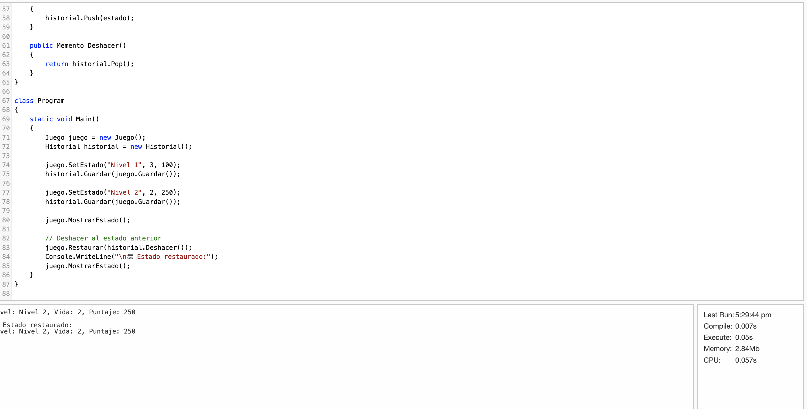

# 🧩 Patrón GoF – Memento  
## Tema: Ruptura de encapsulamiento entre objetos  
---
## Estrada Solano Abraham 22211899 
**Problema elegido:**  
Los objetos acceden directamente al estado interno de otros objetos para modificarlo. ❌ → Rompe encapsulamiento. ¿Dónde está Memento?

---

## 💢 Code Smell detectado
En el sistema, varias clases accedían directamente a los atributos internos de un objeto principal (por ejemplo, `juego.nivel`, `juego.puntaje`, `juego.vida`), alterando su estado sin pasar por métodos controlados.  
Esto provocaba inconsistencias y pérdida de control sobre cuándo o cómo el estado era modificado.

---

## ❌ Código Malo
```csharp
using System;
using System.Collections.Generic;

// Clase principal (sin encapsulamiento)
class Juego
{
    // Atributos públicos: cualquier clase puede modificarlos directamente
    public string nivel;
    public int vida;
    public int puntaje;
}

// Clase que maneja el "historial", pero con acceso directo al estado del juego
class Historial
{
    private List<(string, int, int)> estados = new List<(string, int, int)>();

    public void Guardar(Juego juego)
    {
        // ❌ Acceso directo a los campos internos
        estados.Add((juego.nivel, juego.vida, juego.puntaje));
        Console.WriteLine("💾 Estado guardado manualmente (sin control)");
    }

    public void Restaurar(Juego juego)
    {
        if (estados.Count > 0)
        {
            var ultimo = estados[estados.Count - 1];
            estados.RemoveAt(estados.Count - 1);

            // ❌ Modificación directa del estado interno
            juego.nivel = ultimo.Item1;
            juego.vida = ultimo.Item2;
            juego.puntaje = ultimo.Item3;

            Console.WriteLine("⚠️ Estado restaurado sin encapsulamiento");
        }
        else
        {
            Console.WriteLine("No hay estados previos para restaurar.");
        }
    }
}

class Program
{
    static void Main()
    {
        Juego juego = new Juego();
        Historial historial = new Historial();

        // ❌ Acceso directo a los atributos del objeto
        juego.nivel = "Nivel 1";
        juego.vida = 3;
        juego.puntaje = 100;
        historial.Guardar(juego);

        juego.nivel = "Nivel 2";
        juego.vida = 2;
        juego.puntaje = 250;
        historial.Guardar(juego);

        Console.WriteLine($"🎮 Estado actual: {juego.nivel}, Vida: {juego.vida}, Puntaje: {juego.puntaje}");

        // Restaurar (sin validación ni control)
        historial.Restaurar(juego);
        Console.WriteLine($"🔙 Estado restaurado: {juego.nivel}, Vida: {juego.vida}, Puntaje: {juego.puntaje}");
    }
}

```
---
**Síntoma:**  
- Pérdida del encapsulamiento.  
- Estado del objeto modificado desde afuera.  
- Dificultad para revertir o restaurar un estado anterior.

---

## 🧠 Patrón aplicado: **Memento**

El patrón **Memento** permite **guardar y restaurar el estado interno** de un objeto **sin violar su encapsulamiento**.  
Un “Originator” (objeto original) crea un Memento (una instantánea de su estado), que un “Caretaker” puede almacenar y restaurar cuando sea necesario.

---

## ⚙️ Implementación (Ejemplo funcional en C#)
👉 [dotnetfiddle.net](https://dotnetfiddle.net)


```csharp
using System;
using System.Collections.Generic;

// Originator
class Juego
{
    private string nivel;
    private int vida;
    private int puntaje;

    public void SetEstado(string nivel, int vida, int puntaje)
    {
        this.nivel = nivel;
        this.vida = vida;
        this.puntaje = puntaje;
    }

    public void MostrarEstado()
    {
        Console.WriteLine($"Nivel: {nivel}, Vida: {vida}, Puntaje: {puntaje}");
    }

    public Memento Guardar()
    {
        return new Memento(nivel, vida, puntaje);
    }

    public void Restaurar(Memento m)
    {
        this.nivel = m.Nivel;
        this.vida = m.Vida;
        this.puntaje = m.Puntaje;
    }
}

// Memento
class Memento
{
    public string Nivel { get; }
    public int Vida { get; }
    public int Puntaje { get; }

    public Memento(string nivel, int vida, int puntaje)
    {
        Nivel = nivel;
        Vida = vida;
        Puntaje = puntaje;
    }
}

// Caretaker
class Historial
{
    private Stack<Memento> historial = new Stack<Memento>();

    public void Guardar(Memento estado)
    {
        historial.Push(estado);
    }

    public Memento Deshacer()
    {
        return historial.Pop();
    }
}

class Program
{
    static void Main()
    {
        Juego juego = new Juego();
        Historial historial = new Historial();

        juego.SetEstado("Nivel 1", 3, 100);
        historial.Guardar(juego.Guardar());

        juego.SetEstado("Nivel 2", 2, 250);
        historial.Guardar(juego.Guardar());

        juego.MostrarEstado();

        // Deshacer al estado anterior
        juego.Restaurar(historial.Deshacer());
        Console.WriteLine("\n🔙 Estado restaurado:");
        juego.MostrarEstado();
    }
}

```
## ✅ Beneficios del cambio

- **Encapsulamiento protegido:** el estado se guarda y restaura sin exponer atributos internos.

- **Control del ciclo de vida:** se puede regresar fácilmente a un estado anterior.

- **Extensibilidad:** permite implementar funcionalidades como Undo/Redo.

- **Responsabilidades claras:** Originator, Memento y Caretaker tienen funciones separadas.

## 🧩 Conclusión

El patrón Memento fue la solución ideal para eliminar el acceso directo al estado interno.
Ahora el estado del objeto se maneja de forma controlada y reversible, mejorando la seguridad, mantenibilidad y coherencia del sistema.