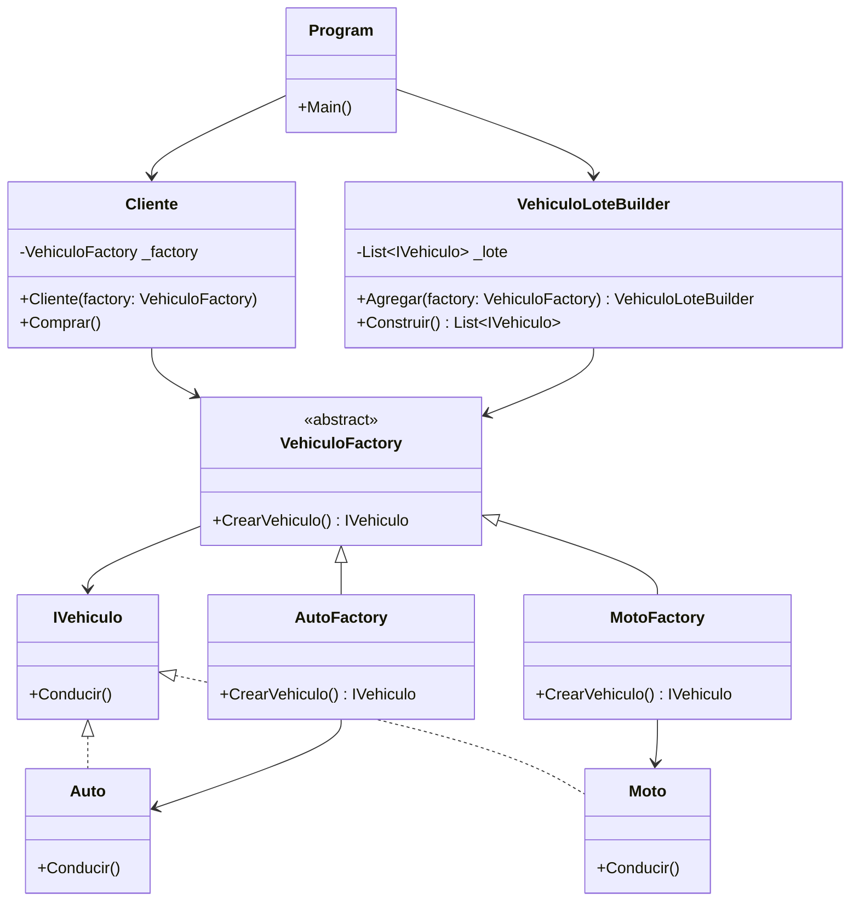

# 🚀 Pull Request - Refactorización de Tienda de Vehículos

En esta practica se genero un BadCode con ayuda de una LLM, de ese codigo generado se identificaron los errores o malas
practicas, y se ofrecio una propuesta de codigo refactorizado y un diagrama UML.

Marcos Ulises Montaño Zaragoza 21211998

🚨 Código en C# (espagueti, .NET 8)

```csharp
// Ejemplo incorrecto que mezcla Abstract Factory con Factory Method
// Temática: Tienda de Vehículos 🚗🏍️

using System;
using System.Collections.Generic;

namespace TiendaVehiculos
{
    // Producto base
    public interface IVehiculo
    {
        void Conducir();
    }

    // Productos concretos
    public class Auto : IVehiculo
    {
        public void Conducir() => Console.WriteLine("Conduciendo un Auto 🚗");
    }

    public class Moto : IVehiculo
    {
        public void Conducir() => Console.WriteLine("Conduciendo una Moto 🏍️");
    }

    // ❌ Aquí empieza la confusión: 
    // Se define una "AbstractFactory" que en realidad hace el trabajo de un Factory Method.
    public abstract class VehiculoFactory
    {
        public abstract IVehiculo CrearVehiculo(string tipo);

        // Se agregan responsabilidades extras que no corresponden aquí
        public virtual List<IVehiculo> CrearLoteDemo()
        {
            var lista = new List<IVehiculo>
            {
                CrearVehiculo("auto"),
                CrearVehiculo("moto")
            };
            return lista;
        }
    }

    // Fábrica concreta que no es realmente "Abstract Factory"
    public class TiendaVehiculoFactory : VehiculoFactory
    {
        public override IVehiculo CrearVehiculo(string tipo)
        {
            if (tipo == "auto")
                return new Auto();
            else if (tipo == "moto")
                return new Moto();
            else
                throw new ArgumentException("Tipo de vehículo no soportado");
        }
    }

    // Cliente que usa directamente la fábrica en vez de interfaces abstractas
    public class Cliente
    {
        private readonly VehiculoFactory _factory;

        public Cliente(VehiculoFactory factory)
        {
            _factory = factory;
        }

        public void Comprar(string tipo)
        {
            var vehiculo = _factory.CrearVehiculo(tipo);
            vehiculo.Conducir();
        }
    }

    public class Program
    {
        public static void Main()
        {
            var tienda = new TiendaVehiculoFactory();
            var cliente = new Cliente(tienda);

            cliente.Comprar("auto");
            cliente.Comprar("moto");

            // ❌ Mal uso: El cliente accede a métodos "extras" de la fábrica
            foreach (var v in tienda.CrearLoteDemo())
            {
                v.Conducir();
            }
        }
    }
}
```
## 🔍 Problemas detectados
- **Clase `VehiculoFactory`**: Se definía como Abstract Factory pero actuaba como Factory Method con condicionales (`if/else`), generando confusión conceptual.  
- **Uso de cadenas mágicas** (`"auto"`, `"moto"`): Fragiliza el código y rompe el principio de abierto/cerrado (OCP).  
- **Clase `TiendaVehiculoFactory`**: Cliente dependía de una implementación concreta en lugar de interfaces, violando el principio de inversión de dependencias (DIP).  
- **Método `CrearLoteDemo`**: Agregaba responsabilidades extras en la fábrica, violando el principio de responsabilidad única (SRP).  

---

## 🛠 Patrón aplicado
- Se **implementa correctamente el Factory Method**: Cada subclase concreta decide cómo instanciar su propio producto.  
- Se **elimina el uso de strings mágicos**: Ahora se crean fábricas especializadas para `Auto` y `Moto`.  
- Se **separa la construcción de lotes** en un **Builder** (`VehiculoLoteBuilder`), evitando sobrecargar la fábrica.  
- Se refactoriza el cliente para trabajar únicamente con la **interfaz de la fábrica**.  

---

## 💡 Justificación del cambio
- **Cohesión interna**: Cada clase tiene una única responsabilidad.  
- **Testabilidad**: Ahora podemos probar cada fábrica de manera aislada.  
- **Flexibilidad ante cambios**: Agregar un nuevo tipo de vehículo solo requiere una nueva fábrica concreta.  

---

## 🔄 Impacto
- Se asegura el cumplimiento de **DIP (Dependency Inversion Principle)**.  
- El sistema queda preparado para **extender tipos de vehículos sin modificar el código existente** (OCP).  
- El cliente queda desacoplado de implementaciones concretas.  

---

## ✅ Código refactorizado (C# .NET 8)

```csharp
using System;
using System.Collections.Generic;

namespace TiendaVehiculos
{
    // Producto base
    public interface IVehiculo
    {
        void Conducir();
    }

    // Productos concretos
    public class Auto : IVehiculo
    {
        public void Conducir() => Console.WriteLine("Conduciendo un Auto");
    }

    public class Moto : IVehiculo
    {
        public void Conducir() => Console.WriteLine("Conduciendo una Moto ");
    }

    // Factory Method: cada fábrica sabe crear su propio producto
    public abstract class VehiculoFactory
    {
        public abstract IVehiculo CrearVehiculo();
    }

    public class AutoFactory : VehiculoFactory
    {
        public override IVehiculo CrearVehiculo() => new Auto();
    }

    public class MotoFactory : VehiculoFactory
    {
        public override IVehiculo CrearVehiculo() => new Moto();
    }

    // Builder para construir lotes de vehículos
    public class VehiculoLoteBuilder
    {
        private readonly List<IVehiculo> _lote = new();

        public VehiculoLoteBuilder Agregar(VehiculoFactory factory)
        {
            _lote.Add(factory.CrearVehiculo());
            return this;
        }

        public List<IVehiculo> Construir() => _lote;
    }

    // Cliente desacoplado
    public class Cliente
    {
        private readonly VehiculoFactory _factory;

        public Cliente(VehiculoFactory factory)
        {
            _factory = factory;
        }

        public void Comprar()
        {
            var vehiculo = _factory.CrearVehiculo();
            vehiculo.Conducir();
        }
    }

    public class Program
    {
        public static void Main()
        {
            // Cliente compra un auto
            var clienteAuto = new Cliente(new AutoFactory());
            clienteAuto.Comprar();

            // Cliente compra una moto
            var clienteMoto = new Cliente(new MotoFactory());
            clienteMoto.Comprar();

            // Construcción de lote de demostración con Builder
            var lote = new VehiculoLoteBuilder()
                .Agregar(new AutoFactory())
                .Agregar(new MotoFactory())
                .Construir();

            Console.WriteLine("\nLote de demostración:");
            foreach (var v in lote)
            {
                v.Conducir();
            }
        }
    }
}
```


## 🧜‍♀️ Diagrama UML generado en Mermaid


## Ayudas recibidas de LLM

Asistencia de IA: Consulté a ChatGPT para que me generara un BadCode con el tema que le di, con el código generado realize la practica.

Herramienta: ChatGPT (GPT-5)

Fecha: 2025-24-09

---

Asistencia de IA: Consulté a ChatGPT para que me ayudara a dar formato markdown, con las sugerencias dadas, le di formato a mi readme.

Herramienta: ChatGPT (GPT-5)

Fecha: 2025-24-09

---

Asistencia de IA: Consulté a ChatGPT para que me ayudara a generar un diagrama UML para mermaid, el diagrama generado lo use para ponerlo en la pagina de
mermaid live.

Herramienta: ChatGPT (GPT-5)

Fecha: 2025-24-09
