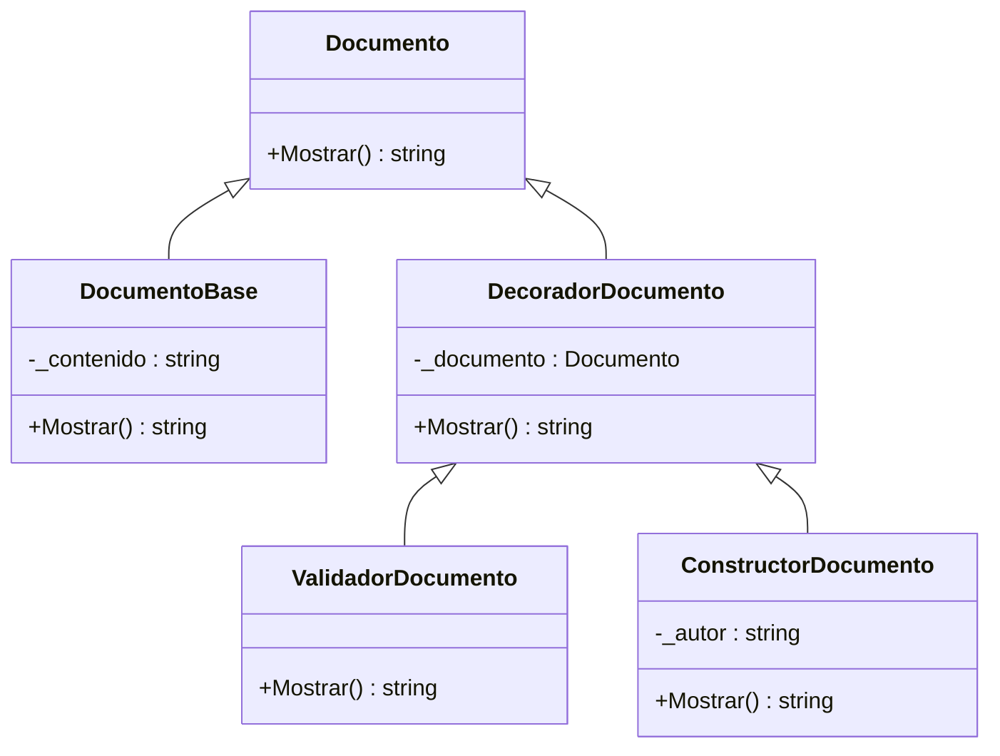

# 🚀 Refactor: Aplicación del Patrón Decorator con Validación y Construcción

## 🔎 1. Problema Detectado (Code Smells)

Se identificaron al menos **3 problemas estructurales** en la clase `Documento` original:

1. **Violación del Principio de Responsabilidad Única (SRP):**  
   La clase valida, construye y muestra contenido al mismo tiempo.  
2. **Código rígido:**  
   Las validaciones están embebidas en la clase, lo que impide modificar reglas sin tocar el código base.  
3. **Falta de extensibilidad (OCP):**  
   No es posible añadir nuevas validaciones o construcciones sin alterar la clase original.  

---

## 💡 2. Solución: Patrón Decorator

Se implementó el **Patrón Estructural Decorator (GoF)** para separar responsabilidades:

- `DocumentoBase`: contiene únicamente el contenido.  
- `ValidadorDocumento`: valida que el documento no esté vacío y tenga longitud mínima.  
- `ConstructorDocumento`: agrega firma u otra lógica de construcción adicional.  

Esto permite **extender el comportamiento sin modificar la clase base**, cumpliendo con **SRP** y **OCP**.  

---

## 📝 3. Código Refactorizado (C# .NET 8)

```csharp
using System;

// Componente base
public abstract class Documento
{
    public abstract string Mostrar();
}

// Componente concreto
public class DocumentoBase : Documento
{
    private readonly string _contenido;

    public DocumentoBase(string contenido)
    {
        _contenido = contenido;
    }

    public override string Mostrar() => _contenido;
}

// Decorador base
public abstract class DecoradorDocumento : Documento
{
    protected Documento _documento;
    protected DecoradorDocumento(Documento documento) => _documento = documento;
}

// Decorador de validación
public class ValidadorDocumento : DecoradorDocumento
{
    public ValidadorDocumento(Documento documento) : base(documento) { }

    public override string Mostrar()
    {
        string contenido = _documento.Mostrar();

        if (string.IsNullOrWhiteSpace(contenido))
            throw new ArgumentException("❌ El documento no puede estar vacío.");

        if (contenido.Length < 5)
            throw new ArgumentException("❌ El documento debe tener al menos 5 caracteres.");

        return $"✅ Documento válido: {contenido}";
    }
}

// Decorador de construcción (ej. firma)
public class ConstructorDocumento : DecoradorDocumento
{
    private readonly string _autor;

    public ConstructorDocumento(Documento documento, string autor) : base(documento)
    {
        _autor = autor;
    }

    public override string Mostrar()
    {
        return $"{_documento.Mostrar()}\n---\nFirmado por: {_autor}";
    }
}

// Programa principal
public class Program
{
    public static void Main()
    {
        try
        {
            Documento doc = new DocumentoBase("Hola mundo");
            Documento docValidado = new ValidadorDocumento(doc);
            Documento docFirmado = new ConstructorDocumento(docValidado, "Evelyn");

            Console.WriteLine(docFirmado.Mostrar());
        }
        catch (Exception ex)
        {
            Console.WriteLine(ex.Message);
        }
```

## 4. Diagrama UML (Mermaid)



## 🖥️ 5. Ejecución

```csharp
Documento doc = new DocumentoBase("Hola mundo");
Documento docValidado = new ValidadorDocumento(doc);
Documento docFirmado = new ConstructorDocumento(docValidado, "Evelyn");

Console.WriteLine(docFirmado.Mostrar());
```

## 6. Salida
```
✅ Documento válido: Hola mundo
---
Firmado por: Evelyn
```

## 📝 Justificación Técnica del PR

 Descripción clara del problema, el patrón aplicado y los beneficios esperados.  


- **Problema:** La clase `Documento` mezclaba validaciones, construcción y visualización en un solo lugar, lo que violaba principios de diseño (SRP, OCP).  
- **Patrón aplicado:** Se utilizó el **Patrón Decorator (GoF)** para separar responsabilidades y permitir extensibilidad sin modificar la clase base.  
- **Beneficios esperados:**  
  - Extender fácilmente las validaciones o construcción sin modificar el código existente.  
  - Mejorar la legibilidad y mantenimiento del sistema.  
  - Mantener un diseño flexible y alineado a buenas prácticas de ingeniería de software.  


