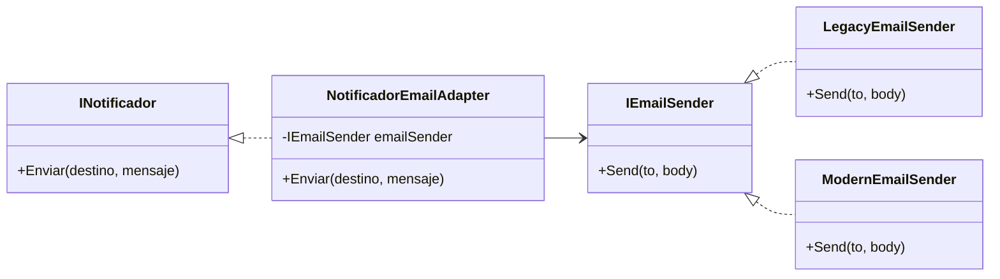

# El adaptador depende de la clase concreta en lugar de una interfaz

**Alumno(a):** Jocelin Maribel Bernal Enciso (Joss)  
**Número de control:** 21211919  
**Materia:** Patrones de Diseño

**Fecha:** 29/09/2025  

---

## Enunciado del tema
Cuando un Adapter depende de una clase concreta en lugar de una interfaz, se genera un code smell estructural.  
Esto rompe el Principio de Inversión de Dependencias (DIP), incrementa el acoplamiento y dificulta la extensibilidad del sistema.

---

## Identificación del Code Smell
El problema aparece cuando el Adapter se implementa creando directamente instancias de una clase concreta en lugar de apoyarse en una abstracción.  
Este error es común cuando se trabaja con librerías legadas o APIs externas y se busca adaptar su comportamiento.  

### Consecuencias técnicas
- El Adapter queda amarrado a una implementación particular.  
- Se rompe la flexibilidad de cambiar a otra librería o servicio sin alterar el Adapter.  
- Se dificulta el testing, ya que no se pueden usar mocks o dobles fácilmente.  
- Aumenta el acoplamiento y se limita la reutilización.  

### Principios de diseño afectados
- **DIP (Dependency Inversion Principle):** los módulos de alto nivel no deben depender de detalles.  
- **OCP (Open/Closed Principle):** el Adapter no está abierto a extensión, ya que cualquier cambio de proveedor requiere modificarlo.  
- **SRP (Single Responsibility Principle):** el Adapter mezcla la responsabilidad de traducir interfaces con la creación de dependencias.

---

## 🧪 Ejemplo con mal diseño (antes del refactor)

```csharp
using System;

namespace BadAdapterExample
{
    public interface INotificador
    {
        void Enviar(string destino, string mensaje);
    }

    // Clase concreta (servicio legado)
    public class LegacyEmailSender
    {
        public void SendEmail(string to, string body)
        {
            Console.WriteLine($"[LegacyEmail] To={to} Body={body}");
        }
    }

    // Adapter acoplado a la clase concreta LegacyEmailSender
    public class NotificadorEmailAdapter : INotificador
    {
        private readonly LegacyEmailSender _email = new LegacyEmailSender();

        public void Enviar(string destino, string mensaje)
        {
            _email.SendEmail(destino, mensaje);
        }
    }

    public class Program
    {
        public static void Main()
        {
            INotificador noti = new NotificadorEmailAdapter();
            noti.Enviar("user@example.com", "Hola desde el Adapter MAL implementado.");
        }
    }
}
```

---

## Refactor aplicando Adapter con interfaces (después del refactor)

```csharp
using System;

namespace GoodAdapterExample
{
    // Interfaz esperada por el cliente
    public interface INotificador
    {
        void Enviar(string destino, string mensaje);
    }

    // Abstracción para proveedores de email
    public interface IEmailSender
    {
        void Send(string to, string body);
    }

    // Implementación concreta 1
    public class LegacyEmailSender : IEmailSender
    {
        public void Send(string to, string body)
        {
            Console.WriteLine($"[LegacyEmail] To={to} Body={body}");
        }
    }

    // Implementación concreta 2
    public class ModernEmailSender : IEmailSender
    {
        public void Send(string to, string body)
        {
            Console.WriteLine($"[ModernEmail] To={to} HtmlBody={body}");
        }
    }

    // Adapter que depende de la INTERFAZ IEmailSender
    public class NotificadorEmailAdapter : INotificador
    {
        private readonly IEmailSender _emailSender;

        public NotificadorEmailAdapter(IEmailSender emailSender)
        {
            _emailSender = emailSender;
        }

        public void Enviar(string destino, string mensaje)
        {
            _emailSender.Send(destino, mensaje);
        }
    }

    public class Program
    {
        public static void Main()
        {
            // Podemos alternar libremente la implementación
            IEmailSender proveedor = new LegacyEmailSender();
            // IEmailSender proveedor = new ModernEmailSender();

            INotificador noti = new NotificadorEmailAdapter(proveedor);
            noti.Enviar("user@example.com", "Hola desde el Adapter BIEN implementado.");
        }
    }
}
```

---

## Desarrollo y explicación del refactor
En este refactor se aplicó el patrón **Adapter** correctamente, garantizando que:  

1. **El cliente (INotificador)** solo depende de la interfaz `IEmailSender`.  
2. El Adapter (`NotificadorEmailAdapter`) **recibe la dependencia por inyección**, lo que permite intercambiar proveedores sin modificar su código.  
3. El diseño ahora es **abierto a extensión y cerrado a modificación (OCP)**: se pueden añadir nuevos proveedores de correo implementando la interfaz sin tocar las clases existentes.  
4. El sistema es **testeable** gracias a la posibilidad de inyectar dobles de prueba.  

Este cambio representa un avance en términos de calidad de software porque reduce la rigidez del sistema y promueve un código más limpio, modular y sostenible.

---

## Validación con pruebas unitarias
Se pueden crear implementaciones falsas de la interfaz `IEmailSender` para validar el comportamiento del Adapter sin necesidad de usar un servicio real.

```csharp
public class FakeEmailSender : IEmailSender
{
    public string LastTo; public string LastBody;
    public void Send(string to, string body)
    {
        LastTo = to; LastBody = body;
    }
}

// Arrange
var fake = new FakeEmailSender();
INotificador sut = new NotificadorEmailAdapter(fake);

// Act
sut.Enviar("a@b.com", "mensaje");

// Assert
Assert.Equal("a@b.com", fake.LastTo);
Assert.Equal("mensaje", fake.LastBody);
```

Esto demuestra que el Adapter traduce correctamente la llamada y que el cliente sigue trabajando con una abstracción.

---

## Diagrama UML (Mermaid)



---

## Conclusión
El adapter acoplado a una clase concreta es un error frecuente que limita la extensibilidad y dificulta el mantenimiento.  
Mediante la refactorización presentada:  
- El Adapter depende de interfaces y no de implementaciones específicas.  
- El diseño es más limpio, modular y escalable.  
- Se facilita el testing y la incorporación de nuevas funcionalidades sin romper el código existente.  

Este ejemplo demuestra cómo aplicar correctamente los principios SOLID dentro de un patrón estructural GoF, asegurando calidad y robustez en sistemas de software modernos.

---
